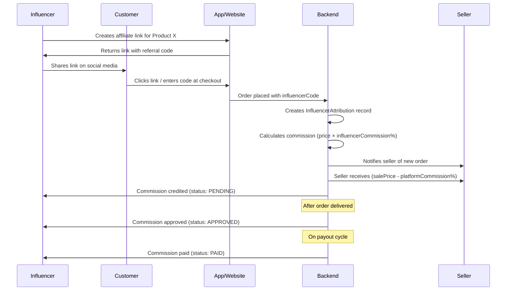
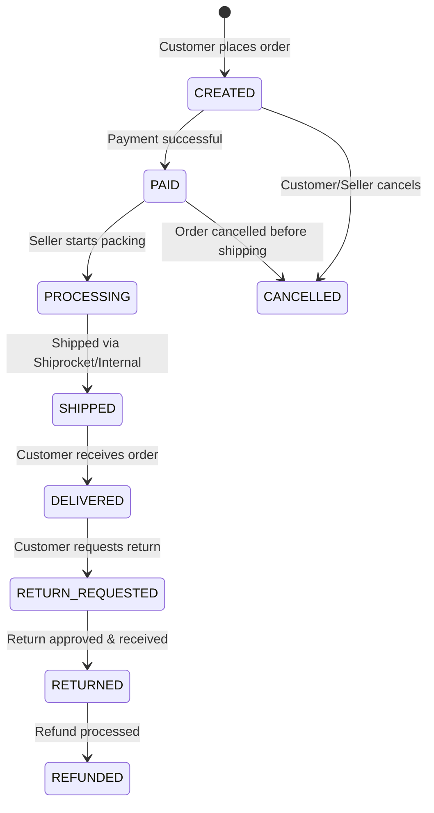

# Local For Vocal — Complete Platform Documentation

> **Version:** 1.0 &nbsp;|&nbsp; **Last Updated:** March 5, 2026  
> **Platform:** iOS (Swift/SwiftUI) &nbsp;|&nbsp; **Backend:** Node.js + Express + MongoDB  
> **Tagline:** *Empowering Local Sellers. Rewarding Digital Influencers.*

---

## Table of Contents

1. [Platform Overview](#1-platform-overview)
2. [Key Stakeholders & Roles](#2-key-stakeholders--roles)
3. [Swift App — Feature Walkthrough](#3-swift-app--feature-walkthrough)
4. [Seller Journey — Step by Step](#4-seller-journey--step-by-step)
5. [Influencer Journey — Step by Step](#5-influencer-journey--step-by-step)
6. [How Affiliate Links Work](#6-how-affiliate-links-work)
7. [Listings & Product Management](#7-listings--product-management)
8. [Commission & Fee Structure](#8-commission--fee-structure)
9. [Competitive Advantage — Why Local For Vocal Wins](#9-competitive-advantage--why-local-for-vocal-wins)
10. [Order Lifecycle](#10-order-lifecycle)
11. [Payments & Wallet](#11-payments--wallet)
12. [Returns & Refunds](#12-returns--refunds)
13. [Additional Features](#13-additional-features)
14. [Technical Architecture](#14-technical-architecture)
15. [Glossary](#15-glossary)

---

## 1. Platform Overview

**Local For Vocal** is a next-generation e-commerce marketplace that bridges the gap between **local Indian sellers** and **digital influencers (content creators)**. Unlike Amazon or Flipkart, which charge sellers **15–42% commissions**, Local For Vocal operates on a **low-margin, high-volume** model that benefits everyone:

| Stakeholder | Our Advantage |
|------------|---------------|
| **Sellers** | Pay significantly lower platform fees (as low as **2–5%**), keeping more profit per sale |
| **Influencers** | Earn **higher affiliate commissions** (up to **10–15%+** per sale) through referral/affiliate links |
| **Customers** | Get competitive prices because sellers aren't burdened by heavy marketplace fees |

### Core Value Proposition

```
┌─────────────────────────────────────────────────────────┐
│                TRADITIONAL MARKETPLACES                  │
│  Seller → Amazon (charges 15-42%) → Customer            │
│  Influencer earns: 1-5% affiliate commission            │
│                                                         │
│              LOCAL FOR VOCAL MODEL                       │
│  Seller → Platform (charges 2-5%) → Customer            │
│  Influencer earns: 10-15%+ affiliate commission         │
│  Seller keeps: 90-95%+ of sale price                    │
└─────────────────────────────────────────────────────────┘
```

---

## 2. Key Stakeholders & Roles

The platform supports **11 distinct user roles**, each with specific permissions:

| Role | Description |
|------|-------------|
| `CUSTOMER` | Default role for all app users; can browse, buy, review products |
| `INFLUENCER` | Content creators who share affiliate links and earn commissions |
| `BUSINESS_OWNER` | Sellers who list products and manage their store on the platform |
| `BUSINESS_MANAGER` | Staff with elevated permissions to manage a seller's operations |
| `BUSINESS_STAFF` | Basic staff access for order fulfillment |
| `SELLER_OWNER` / `SELLER_MANAGER` / `SELLER_STAFF` | Legacy seller hierarchy roles |
| `DELIVERY_PARTNER` | Personnel who handle last-mile delivery |
| `ADMIN` | Platform administrators with analytics and management access |
| `SUPER_ADMIN` | Full system access including seller approvals, financial config |

### Role Transitions

A user can seamlessly transition between roles:
- **Customer → Influencer:** Register via the in-app influencer registration sheet
- **Customer → Seller:** Apply via the "Sell on Platform" flow (comprehensive KYC onboarding)
- **Influencer accounts** have a dedicated dashboard (web + in-app) for managing links and earnings

---

## 3. Swift App — Feature Walkthrough

The iOS app is built with **SwiftUI** and features a rich, category-driven shopping experience.

### 3.1 App Architecture

```
Sources/
├── Models/          → Product, Address, Story, SDUI, Banner models
├── Services/        → APIService, AuthManager, RazorpayService, OrderService,
│                      KafkaEventService, LocationManager, KeychainManager
├── Managers/        → CartManager, WishlistManager, NavigationManager,
│                      SDUICacheManager, ReviewManager, LayoutPreloader,
│                      NetworkMonitor, HapticManager, ImageDiskCache
├── ViewModels/      → CheckoutViewModel, SDUIPageViewModel, SearchViewModel
├── Views/
│   ├── Pages/       → 44 full-page views (see below)
│   ├── Components/  → 72 reusable UI components
│   ├── Fashion/     → Fashion vertical views
│   ├── Themes/      → Theme/styling
│   ├── BannerPages/ → Dynamic banner pages
│   └── Modifiers/   → Custom SwiftUI modifiers
└── Utils/           → Helpers, extensions
```

### 3.2 Core App Features

#### 🏠 Home & Discovery
- **Server-Driven UI (SDUI):** Pages are rendered dynamically via JSON layouts from the backend — enabling real-time content changes without app updates
- **Hero Banners & Carousels:** Full-width promotional banners with auto-scroll
- **Story System:** Instagram-like stories where influencers/sellers can post short-lived content
- **Location-Based Shopping:** GPS-powered location picker to surface nearby products and sellers

#### 🛍️ Shopping Experience
- **Category Pages:** Fashion, Beauty, Electronics, Sports, Furniture, Books, Grocery — each with dedicated, themed views
- **Product Detail View:** Rich product pages with image galleries, variants (color, size), offers, reviews, trust badges, protection promises
- **Product Variants:** Full variant system with SKU-level pricing, stock, and images (e.g., color + size combinations)
- **Last Chance Offers:** Popup-style urgency deals on product pages
- **Trust Badges:** Visual indicators (e.g., "Verified Seller", "Quality Assured") on products

#### 🔍 Search & Discovery
- **Global Search:** Full-text search with autocomplete and recent history
- **Category Browsing:** Two-pane category explorer with subcategory sliders
- **Browser History:** Tracks recently viewed products

#### 🛒 Cart & Checkout
- **Unified Cart System:** Supports multi-seller, multi-item carts
- **Smart Basket:** Intelligent product grouping and suggestions
- **3-Step Checkout Flow:**
  1. **Delivery Address** — Saved addresses + location picker + new address form
  2. **Order Summary** — Product cards, price breakdown, coupons, influencer codes, donation option
  3. **Payment** — Razorpay integration (UPI, cards, net banking, wallets) + COD option
- **Coupon System:** Flat and percentage-based coupons with min-order and max-discount rules
- **Influencer Code at Checkout:** Customers can enter an influencer's referral code at checkout for discounts, and the influencer earns commission on that sale

#### 💳 Payments
- **Razorpay Integration:** Full-featured payment gateway with success/failure/cancellation handling
- **Payment Methods:** UPI, Credit/Debit Cards, Net Banking, Wallets, COD
- **Payment Result Screens:** Dedicated success (with confetti animation), failure (with shake animation), and cancellation views using Lottie animations
- **Payment Loading Overlay:** Smooth transition during payment processing

#### 📦 Orders & Returns
- **My Orders View:** Full order history with status tracking
- **Order Status Flow:** Created → Paid → Processing → Shipped → Delivered
- **Returns System:** Return/replacement requests with image upload, reason selection, and approval tracking
- **Shiprocket Integration:** AWB tracking, courier assignment, label generation

#### 👤 Account & Profile
- **Firebase Authentication:** Google Sign-In, Apple Sign-In, phone number OTP
- **Profile Editor:** Name, image, contact details
- **Wallet View:** Coin balance display with full transaction history (credit/debit)
- **Wishlist:** Save products for later with persistent storage
- **Plus Membership:** Premium membership tier for enhanced benefits
- **Help Center:** In-app support and FAQ
- **Language Selection:** Multi-language support
- **Privacy Policy & Terms:** Legal compliance pages

#### 📢 Influencer Features (In-App)
- **Influencer Registration Sheet:** In-app signup flow to become an influencer
- **Influencer Shop Page:** Each influencer gets a personalized storefront showing their curated products, collections, profile, and story ring
- **Share Functionality:** Native sharing of influencer shop page with deep link (`localforvocalstartup.com/shop/{referralCode}`)
- **Affiliate Product Grid:** Visual grid of all products the influencer promotes with "Curated by {Name}" badges
- **Story Upload:** Influencers can create and publish stories to engage followers

#### 🔔 Notifications
- **FCM Push Notifications:** Firebase Cloud Messaging for order updates, promotions, and alerts
- **In-App Notification Center:** Centralized view for all notifications

---

## 4. Seller Journey — Step by Step

### Step 1: Registration & Account Type Selection

Sellers choose their account type:
- **New Account** → Fresh business registration
- **Convert Account** → Upgrading an existing customer account to a seller account

### Step 2: Business Identity

| Field | Details |
|-------|---------|
| Legal Business Name | Registered company name |
| Trade Name | Brand name used publicly |
| Business Type | Proprietorship, Partnership, LLP, Private Limited, Public Limited, Trust/NGO, or Influencer |
| Nature of Business | Manufacturer, Wholesaler, Distributor, Retailer, Service Provider, Content Creator, or Influencer |
| Year of Establishment | When the business was founded |

### Step 3: Owner / Authorized Person Details

- Full name, designation, mobile, email
- Government ID (Aadhaar / PAN / Passport) with document upload
- Optional: Date of birth, gender

### Step 4: Business Addresses

Three address types are captured:
1. **Registered Address** (mandatory) — Legal business address
2. **Operational Address** — Can mark "same as registered"
3. **Warehouse Address** (optional) — For inventory storage

### Step 5: Tax & Legal Compliance

| Document | Purpose |
|----------|---------|
| GSTIN Number | GST registration (Regular or Composition) |
| GST Certificate | Uploaded proof |
| PAN Number + PAN Card | Tax identity |
| CIN / LLPIN | For companies / LLPs |
| Shop Establishment License | Local body compliance |
| MSME / Udyam Number | For MSME benefits |

### Step 6: Bank & Payment Details

| Field | Purpose |
|-------|---------|
| Account Holder Name | For settlement verification |
| Bank Name + Account Number | Where sales proceeds are deposited |
| IFSC Code | Bank branch identifier |
| Account Type | Savings or Current |
| Cancelled Cheque | Bank verification document |
| Settlement Cycle | **Daily, Weekly, or Bi-Weekly** payouts |

### Step 7: KYC Verification

Sellers must upload:
- Business address proof
- Owner selfie
- Signature specimen
- Authorization letter (if representative)

**Verification Status Flow:** `PENDING` → `APPROVED` / `REJECTED` / `SUSPENDED`

### Step 8: Store Profile Setup

- Upload store logo
- Write store description
- Select product categories
- Declare brand ownership: **Own Brand**, **Authorized Seller**, or **Reseller**
- Optional: Website URL, social media links (Facebook, Instagram, Twitter, LinkedIn)

### Step 9: Logistics Configuration

| Setting | Options |
|---------|---------|
| Pickup Address | Where orders are collected |
| Pickup Time Slot | Preferred pickup window |
| Packaging Type | **Seller Packed** or **Platform Packed** |
| Courier Preference | Preferred logistics partner |
| Return Address | Where returns are shipped |
| Return Policy | Must accept platform return policy |

### Step 10: Compliance Agreement

Sellers must accept:
- ✅ Seller Agreement
- ✅ Platform Policies
- ✅ Tax Responsibility Declaration

### Step 11: Go Live!

Once approved, sellers gain access to:
- **Seller Dashboard** (web) — Manage products, orders, inventory, analytics
- Product listing tools with full variant support
- Real-time order management
- Shiprocket integration for automated shipping

---

## 5. Influencer Journey — Step by Step

### Step 1: In-App Registration

1. Open the app and navigate to the influencer section
2. Tap **"Become an Influencer"** or access the **Influencer Registration Sheet**
3. Provide name and email
4. The system automatically generates a **unique referral code** (e.g., `PRIYA8K2M`)
5. Account role is upgraded from `CUSTOMER` to `INFLUENCER`

### Step 2: Profile Setup

Influencers can set up their profile with:

| Field | Purpose |
|-------|---------|
| Name | Display name on shop page |
| Bio | Short description shown on their storefront |
| Profile Image | Avatar for shop and social |
| Social Media Links | Instagram, YouTube, Twitter, Facebook, TikTok |
| Follower Counts | Per-platform follower numbers for analytics |
| Phone Number | Contact for payouts |

### Step 3: Create Affiliate Links

1. Browse any product in the catalog
2. Generate an **affiliate link** for the product
3. The link format: `localforvocalstartup.com/products/{productId}?ref={REFERRAL_CODE}`
4. Share the link on social media, WhatsApp, YouTube, etc.
5. When a customer uses the link or enters the referral code at checkout, the influencer gets credited

### Step 4: Curate Your Shop

Each influencer gets a **personal storefront** (`InfluencerShopView`) showing:
- Profile photo with Instagram-like story ring
- Verified badge
- Bio and product count
- Auto-categorized collections (Fashion, Footwear, Accessories, etc.)
- **Product grid** with product images, prices, seller names, and "Curated by {Name}" badges
- Shareable link: `localforvocalstartup.com/shop/{referralCode}`

### Step 5: Track Performance

Via the **Influencer Dashboard** (web app), influencers can monitor:

| Metric | Description |
|--------|-------------|
| Total Clicks | Link click count |
| Total Conversions | Orders placed via affiliate links |
| Conversion Rate | Clicks to purchase ratio |
| Today's Earnings | Real-time daily income |
| This Week's Earnings | Weekly performance |
| This Month's Earnings | Monthly performance |
| All-Time Earnings | Lifetime commissions |
| Pending Earnings | Approved but not yet paid |
| Paid Earnings | Successfully transferred to bank |

Additional analytics include:
- **Top Performing Products** — Products ranked by commission earned
- **Clicks Over Time** — Daily click/conversion trend chart (7/30/90 days)
- **Attribution History** — Detailed log of every click, conversion, and payout

### Step 6: Get Paid

1. Commission is calculated per order based on the product's `influencerCommission` percentage
2. Attribution status flow: `PENDING` → `APPROVED` → `PAID`
3. Payouts are processed to the influencer's registered bank account

---

## 6. How Affiliate Links Work

### The Complete Flow



### Attribution Model

Each sale through an affiliate link creates an **InfluencerAttribution** record:

| Field | Description |
|-------|-------------|
| `influencerUserId` | The influencer who referred the sale |
| `businessId` | The seller whose product was sold |
| `brandId` | The brand under which the product is listed |
| `productId` | The specific product sold |
| `orderId` | The order that was placed (unique per attribution) |
| `commissionAmount` | Calculated amount: `order value × influencerCommission%` |
| `status` | PENDING → APPROVED → PAID (or REJECTED) |

---

## 7. Listings & Product Management

### Product Fields

Sellers can list products with comprehensive details:

#### Basic Information
| Field | Required | Description |
|-------|----------|-------------|
| Title | ✅ | Product name (auto-generates SEO slug) |
| Description | ❌ | Full product description |
| Short Description | ❌ | Brief summary |
| Product Type | ✅ | Physical, Digital, or Service |
| Category | ✅ | Product category |
| Brand | ❌ | Brand name |

#### Pricing
| Field | Description |
|-------|-------------|
| Price | Selling price (must be > 0) |
| MRP | Maximum Retail Price (for showing discounts) |
| Platform Commission | Percentage taken by the platform (e.g., 2–5%) |
| Influencer Commission | Percentage allocated for influencer referrals (e.g., 10–15%) |

#### Inventory & Variants
| Field | Description |
|-------|-------------|
| Stock | Current inventory count |
| Low Stock Threshold | Alert level (default: 5) |
| Variant Config | Variant axes (e.g., ["color", "size"]) |
| Variants | Array of SKU-level variants with individual price, stock, images |
| Barcode | Product barcode |
| Max/Min Order Qty | Purchase limits |
| Inventory Type | Seller-managed or Platform-managed |

#### Media
| Field | Description |
|-------|-------------|
| image | Primary product image |
| images[] | Gallery of additional images |
| primaryImage | Hero image for listing cards |
| thumbnailImage | Optimized thumbnail |

#### Shipping & Logistics
| Field | Description |
|-------|-------------|
| Shipping Charges | Delivery fee (₹0 for free shipping) |
| Weight | Product weight (default 500g) |
| Dimensions | Length × Breadth × Height |
| COD Available | Cash on Delivery option |
| Processing Time | Fulfillment time (hours/days) |
| Pickup Location | Seller's pickup point |

#### Offers & Promotions
- **Bank Offers:** Payment method-specific discounts
- **Exchange Offers:** Trade-in deals
- **EMI Options:** Installment plans
- **Last Chance Offers:** Limited-time urgency popup deals
- **Trust Badges:** Quality/authenticity indicators

#### Grocery-Specific Fields (for Grocery vertical)
- HSN Code, GST Rate, Country of Origin
- FSSAI License, Allergens, Certifications
- Nutrition facts (calories, protein, carbs, fats, vitamins)
- Shelf life, manufacturing/expiry dates, storage instructions
- Pack size, net quantity, organic/GMO status

#### SEO
| Field | Description |
|-------|-------------|
| Meta Title | SEO page title |
| Meta Description | SEO description |
| Meta Keywords | Search keywords |

### Product Approval Flow

```
Seller uploads product → Status: PENDING
                            ↓
                  Admin reviews listing
                     ↙          ↘
              APPROVED          REJECTED
           (isActive: true)   (with approval note)
```

Products start as `inactive` and only appear in the catalog after admin approval.

---

## 8. Commission & Fee Structure

### How Money Flows on Each Sale

```
┌─────────────────────────────────────────────────────────┐
│                 SALE PRICE: ₹1,000                      │
├─────────────────────────────────────────────────────────┤
│                                                         │
│  Platform Commission (e.g., 5%):        ₹50             │
│    ├── Platform's Revenue:              ₹25             │
│    └── Influencer Commission (e.g., 50% ₹25             │
│        of platform commission):                         │
│                                                         │
│  Seller Receives:                       ₹950            │
│  (Sale Price - Platform Commission)                     │
│                                                         │
│  Influencer Earns:                      ₹25             │
│  (From the platform commission pool)                    │
│                                                         │
└─────────────────────────────────────────────────────────┘
```

### Commission Configuration (Per Product)

Each product has two configurable commission percentages:

| Field | Range | Purpose |
|-------|-------|---------|
| `platformCommission` | 0–100% | Total fee the platform takes from the seller per sale |
| `influencerCommission` | 0–100% | Portion allocated to the referring influencer (subset of or separate from platform commission) |

### Local For Vocal vs. Traditional Marketplaces

| Metric | Amazon / Flipkart | Local For Vocal |
|--------|-------------------|-----------------|
| **Seller Commission (Platform Fee)** | 15–42% of sale price | **2–5%** of sale price |
| **Influencer/Affiliate Payout** | 1–5% via affiliate programs | **10–15%+** per referred sale |
| **Seller Take-Home** | 58–85% | **90–95%+** |
| **Listing Fees** | Often additional charges | **Free** |
| **Settlement Cycle** | 7–14 days | **Daily / Weekly / Bi-Weekly** (seller's choice) |

### Why This Works

1. **Lower seller fees** → Sellers can offer more competitive prices
2. **Higher influencer commissions** → Influencers are incentivized to promote products actively
3. **Direct brand-influencer connection** → No middlemen; attribution is tracked per product, per order
4. **Flexible commission per product** → Sellers and admin can set different commission rates for different products/categories

### Example Scenarios

#### Scenario 1: Fashion Item (₹2,000)
```
Platform Commission: 3%   = ₹60
Influencer Payout:   10%  = ₹200 (from seller's marketing budget)
Seller Receives:     ₹1,740
Customer Pays:       ₹2,000
```

#### Scenario 2: Electronics (₹15,000)
```
Platform Commission: 2%   = ₹300
Influencer Payout:   5%   = ₹750
Seller Receives:     ₹13,950
Customer Pays:       ₹15,000
```

#### Scenario 3: Beauty Product (₹500)
```
Platform Commission: 5%   = ₹25
Influencer Payout:   15%  = ₹75
Seller Receives:     ₹400
Customer Pays:       ₹500
```

---

## 9. Competitive Advantage — Why Local For Vocal Wins

### For Sellers

| Pain Point on Amazon/Flipkart | How Local For Vocal Solves It |
|-------------------------------|------------------------------|
| High commission (15–42%) eats into margins | **Only 2–5% platform fee** — sellers keep more |
| Long settlement cycles (7–14 days) | **Daily/Weekly/Bi-Weekly** settlement options |
| No direct customer relationship | **Direct communication** with buyers |
| Complex listing process | **Streamlined product upload** with admin support |
| Pay for visibility (PPC ads) | **Influencer-driven organic traffic** |
| Returns abuse erodes profits | **Regulated return policy** with seller protections |

### For Influencers

| Pain Point with Amazon Associates | How Local For Vocal Solves It |
|-----------------------------------|------------------------------|
| Only 1–5% commission on sales | **10–15%+ commission** per referred sale |
| No personal storefront | **Dedicated influencer shop page** with curated products |
| Cookie-based tracking (24hr limit) | **Referral code–based tracking** (no expiry at checkout) |
| No real-time analytics | **Live dashboard** with clicks, conversions, revenue trends |
| Generic product links | **Personalized "Curated by {Name}" badges** on products |
| No story/content features | **Instagram-like stories** for product promotion |

### For Customers

| Benefit | Description |
|---------|-------------|
| **Better Prices** | Sellers pass on savings from lower platform fees |
| **Trusted Recommendations** | Products curated by influencers they already follow |
| **Support Local** | Buy directly from Indian sellers and brands |
| **Full Protection** | Razorpay-secured payments, return/replacement policy |
| **Premium Experience** | Lottie-animated payment flows, smooth SwiftUI interface |

---

## 10. Order Lifecycle

### Status Flow



### Order Data Structure

Each order captures:
- **Items:** Array of products with price and quantity
- **Shipping Address:** Full Indian address with pincode
- **Payment Info:** Provider (Razorpay/COD), payment ID, status, instrument type
- **Influencer Code:** Referral code applied at checkout
- **Coupon Code:** Discount coupon if applied
- **Financial Breakdown:** Item total, shipping charges, discount, protection fee, payable amount, total amount
- **Add-Ons:** Additional services/offers selected by customer
- **Shipping:** Internal delivery or Shiprocket (with AWB, tracking URL, courier details)

### Shipping Integration

| Method | Description |
|--------|-------------|
| **Shiprocket** | Primary logistics partner with automated AWB, label printing, courier selection, and tracking |
| **Internal** | Platform's own delivery network for local/hyperlocal orders |

Shiprocket data tracked per order:
- Order ID, Shipment ID, AWB Code
- Courier Name, Label URL, Manifest URL, Invoice URL
- Pickup scheduling and status
- Actual shipping cost and tracking URL

---

## 11. Payments & Wallet

### Payment Providers

| Provider | Status |
|----------|--------|
| Razorpay | ✅ Primary (UPI, Cards, Net Banking, Wallets) |
| Paytm | Configured |
| Cashfree | Configured |
| COD | ✅ Active |

### Razorpay Flow in the App

1. Customer taps "Place Order" → `CheckoutViewModel` creates order via API
2. `RazorpayService.swift` opens the Razorpay payment sheet
3. Three outcomes handled with dedicated UI:
   - ✅ **Success** → Confetti Lottie animation, order confirmation
   - ❌ **Failure** → Shake animation, retry option
   - ⚠️ **Cancelled** → Amber-themed cancellation screen with retry

### Wallet System (Coins)

| Feature | Description |
|---------|-------------|
| Balance Display | Total coins shown in wallet header |
| Transaction History | Chronological list of credits/debits |
| Adding Coins | Admin/system credits (referral rewards, cashback) |
| Spending Coins | Deducted during checkout |
| Pull-to-Refresh | Real-time balance sync |

Transactions are recorded with:
- Type: `CREDIT` / `DEBIT`
- Amount, description, reference ID
- Status: `PENDING` / `COMPLETED` / `FAILED`

---

## 12. Returns & Refunds

### Return Policy

| Feature | Details |
|---------|---------|
| Return Window | As per product/seller policy |
| Return Types | **Return** (full refund) or **Replacement** |
| Return Status | PENDING → APPROVED / REJECTED → COMPLETED |
| Image Upload | Photo evidence required with return request |
| Rejection | Seller/admin can reject with reason |
| Refund | Processed to original payment method or wallet |

### Return Handling Flow

```
Customer raises return → Upload images + reason
         ↓
Admin/Seller reviews request
    ↙            ↘
APPROVED        REJECTED (with reason)
    ↓
Pickup scheduled
    ↓
Item returned → Refund processed
```

---

## 13. Additional Features

### Sponsored Products

Sellers can boost product visibility through sponsorships:

| Field | Description |
|-------|-------------|
| Budget | Total campaign budget |
| Daily Budget | Maximum daily spend |
| Duration | Start date to end date |
| Status | PENDING → APPROVED → ACTIVE → PAUSED / REJECTED |

Sponsored products receive a `sponsoredScore` that elevates their position in search results and category listings.

### Coupon System

| Feature | Options |
|---------|---------|
| Type | `FLAT` (₹ off) or `PERCENT` (% off) |
| Min Order Amount | Minimum cart value to apply |
| Max Discount | Cap on percentage-based discounts |
| Usage Limit | Total times the coupon can be used |
| Validity | Start date and end date |

### Server-Driven UI (SDUI)

The app uses a **server-driven UI** system where page layouts are defined in JSON on the backend. This enables:
- Real-time layout changes without app updates
- A/B testing of homepage designs
- Seasonal/festive theme changes
- Per-category page customization

### Stories

Instagram-like stories for influencers and sellers:
- Upload images/videos
- Auto-expiry
- Story ring indicator on profile
- Full-screen player with auto-advance

### Plus Membership

Premium tier offering enhanced benefits to loyal customers.

### Delivery Partner System

- Dedicated delivery partner app
- Real-time location tracking
- Status updates: Pending Pickup → Searching → Out for Delivery → Delivered

---

## 14. Technical Architecture

### System Overview

```
┌──────────────┐    ┌──────────────────┐    ┌──────────────┐
│   iOS App    │    │  Seller Dashboard │    │  Influencer  │
│  (SwiftUI)   │    │   (Next.js)       │    │  Dashboard   │
│              │    │                    │    │  (Next.js)   │
└──────┬───────┘    └────────┬──────────┘    └──────┬───────┘
       │                     │                      │
       └─────────────────────┼──────────────────────┘
                             │
                    ┌────────▼────────┐
                    │   Backend API    │
                    │ (Express + TS)   │
                    │    56 Routes     │
                    └────────┬────────┘
                             │
              ┌──────────────┼──────────────┐
              ▼              ▼              ▼
        ┌──────────┐  ┌──────────┐  ┌──────────┐
        │ MongoDB  │  │ Firebase │  │ Razorpay │
        │(32 Models)│  │  Auth    │  │ Payments │
        └──────────┘  └──────────┘  └──────────┘
              │
              ├── Shiprocket (Logistics)
              ├── AWS S3 (Media Storage)
              ├── Kafka (Event Streaming)
              └── FCM (Push Notifications)
```

### Key Technologies

| Layer | Technology |
|-------|-----------|
| iOS App | Swift, SwiftUI, Combine |
| Authentication | Firebase Auth (Google, Apple, Phone OTP) |
| Backend | Node.js, Express.js, TypeScript |
| Database | MongoDB with Mongoose ODM |
| Payments | Razorpay SDK |
| Logistics | Shiprocket API |
| Media Storage | AWS S3 |
| Push Notifications | Firebase Cloud Messaging (FCM) |
| Event Tracking | Kafka |
| Image Caching | Custom disk cache with memory cache |
| State Management | @StateObject, @EnvironmentObject, Managers |

### Backend API Routes (56 Routes)

| Category | Key Routes |
|----------|------------|
| Auth | `/auth/sync`, registration, token refresh |
| Products | CRUD, search, filtering, approval, sponsorship |
| Orders | Create, track, cancel, update status |
| Cart | Add/remove items, quantity update |
| Influencer | Register, profile, metrics, affiliate links, analytics, attributions |
| Business | Registration, profile, product management |
| Payments | Razorpay order creation, verification |
| Wallet | Balance, transaction history, add/deduct coins |
| Returns | Request, approve/reject, refund |
| Delivery | Partner assignment, status updates |
| Admin | Dashboard analytics, user management, approvals |

---

## 15. Glossary

| Term | Definition |
|------|-----------|
| **Affiliate Link** | A product URL containing an influencer's referral code; tracks sales attribution |
| **Attribution** | Record linking an order to the influencer who referred it |
| **Platform Commission** | Percentage fee the platform charges sellers per sale (configurable per product) |
| **Influencer Commission** | Percentage of the sale given to the referring influencer |
| **Referral Code** | Unique alphanumeric code assigned to each influencer (e.g., `PRIYA8K2M`) |
| **SDUI** | Server-Driven UI — page layouts served as JSON from the backend |
| **COD** | Cash on Delivery — customer pays upon receiving the order |
| **AWB** | Air Waybill — shipment tracking number from logistics provider |
| **KYC** | Know Your Customer — identity verification process for sellers |
| **GSTIN** | Goods and Services Tax Identification Number |
| **FSSAI** | Food Safety and Standards Authority of India — required for food products |
| **HSN Code** | Harmonized System Nomenclature — commodity classification code for tax |
| **Trust Badge** | Visual indicator on products certifying quality or seller verification |
| **Story** | Short-lived visual content (like Instagram Stories) for product promotion |
| **Settlement Cycle** | Frequency at which seller earnings are transferred (Daily/Weekly/Bi-Weekly) |

---

> **Local For Vocal** — *Less fees for sellers. More earnings for influencers. Better deals for everyone.* 🇮🇳
